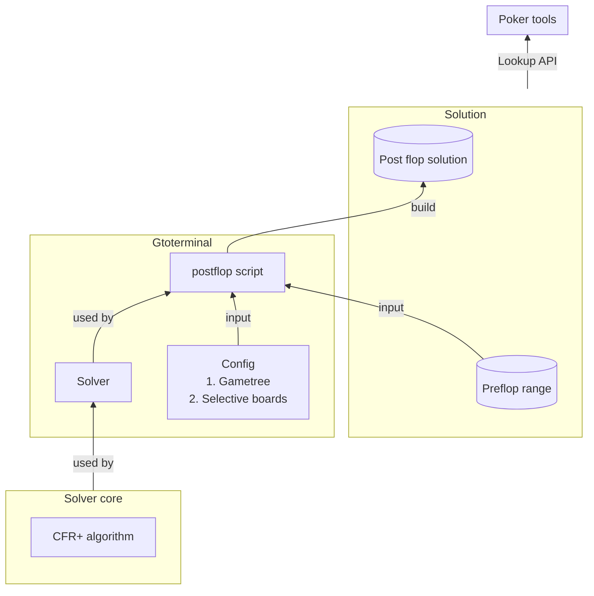

# EDO Solver

| Directory | Description |
|-----------|-------------|
| **Postflop solver** | Contains core algorithm |
| **GTO terminal** | Solve specific spots, extract data from solving pipeline and save into solutions to reuse. Python part: lookup API for game tool |

In the below graph, arrow direction specify data flow

## Imporant files
| Files     | Description |
|-----------|-------------|
|/scripts/precompute-preflop.js| Script to gather input and run solver |