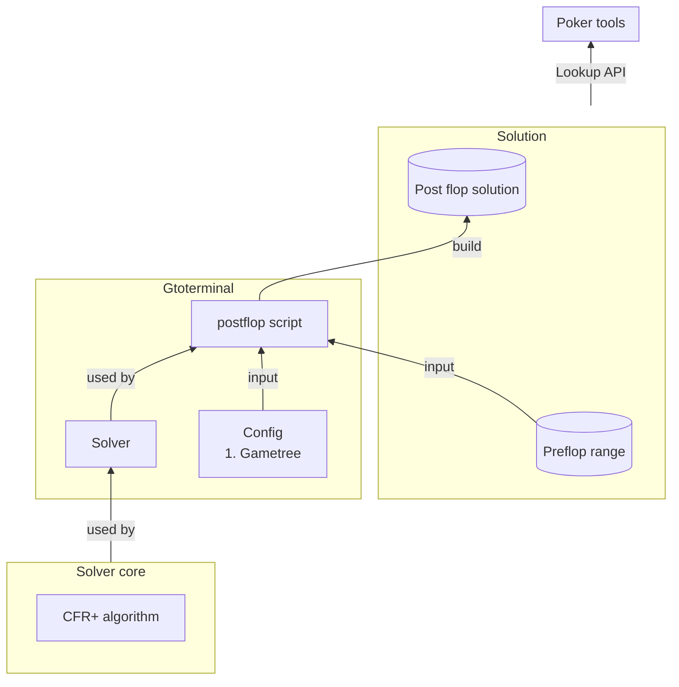

# EDO Solver

| Directory | Description |
|-----------|-------------|
| **Postflop solver** | Chứa thuật toán solver |
| **GTO terminal** | Sử dụng thuật toán solver, nhận input, solve, chứa code extract data từ solution để sử dụng, chứa lookup API cho game client query data |

In the below graph, arrow direction specify data flow

