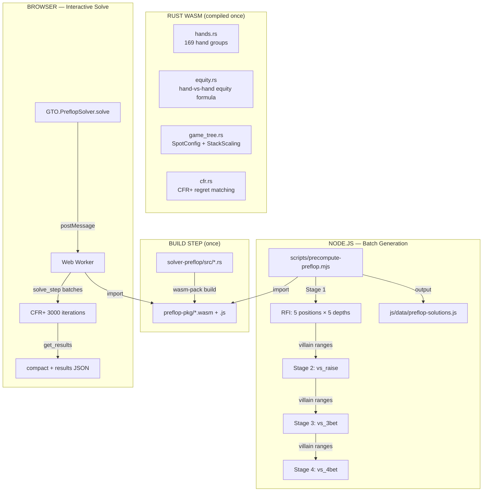
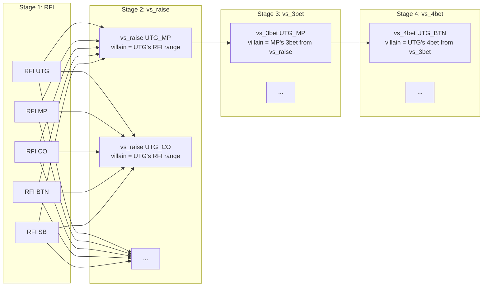

# Preflop Solver — Step-by-Step Guide to Generate Missing Spots

## Overview

The preflop solver uses a **custom CFR+ algorithm** compiled to **WebAssembly** that can run in **Node.js** (batch) or in a **browser** (interactively). It outputs GTO ranges for 169 hand groups choosing between {fold, call, raise}.

---

## Spot Matrix: What's Covered vs Missing

```
                    ┌─── RFI ───┬── vs_raise ──┬── vs_3bet ──┬── vs_4bet ──┐
  100bb (5 pos)     │  UTG ✓    │ UTG_MP ✓     │ UTG_MP ✓    │ UTG_BTN ✓   │
                    │  MP  ✓    │ UTG_CO ✓     │ UTG_CO ✓    │ UTG_BB  ✓   │
                    │  CO  ✓    │ UTG_BTN ✓    │ UTG_BTN ✓   │ MP_BTN  ✓   │
                    │  BTN ✓    │ UTG_SB  ✓    │ UTG_SB  ✓   │ MP_BB   ✓   │
                    │  SB  ✓    │ UTG_BB  ✓    │ UTG_BB  ✓   │ CO_BTN  ✓   │
                    │           │ MP_CO   ✓    │ MP_CO   ✓   │ CO_BB   ✓   │
                    │           │ MP_BTN  ✓    │ MP_BTN  ✓   │ BTN_SB  ✓   │
                    │           │ MP_SB   ✓    │ MP_SB   ✓   │ BTN_BB  ✓   │
                    │           │ MP_BB   ✓    │ MP_BB   ✓   │               │
                    │           │ CO_BTN  ✓    │ CO_BTN  ✓   │               │
                    │           │ CO_SB   ✓    │ CO_SB   ✓   │               │
                    │           │ CO_BB   ✓    │ CO_BB   ✓   │               │
                    │           │ BTN_SB  ✓    │ BTN_SB  ✓   │               │
                    │           │ BTN_BB  ✓    │ BTN_BB  ✓   │               │
                    │           │ SB_BB   ✓    │ SB_BB   ✓   │               │
                    │           │             │             │               │
  40bb  (same)      │  ALL ✓    │ ALL ✓        │ ALL ✓       │ ALL ✓        │
  25bb  (same)      │  ALL ✓    │ ALL ✓        │ ALL ✓       │ ALL ✓        │
  20bb  (same)      │  ALL ✓    │ ALL ✓        │ ALL ✓       │ ALL ✓        │
  15bb  (same)      │  ALL ✓    │ ALL ✓        │ ALL ✓       │ ALL ✓        │
                    └───────────┴──────────────┴─────────────┴──────────────┘
```

**Total**: 5 depths × (5 RFI + 15 vs_raise + 15 vs_3bet + 8 vs_4bet) = **215 spots**
**Current**: ~200/215 spots generated (some spots skipped when villain has 0 combos in dependency chain)

---

## Architecture: How the Solver Works



---

## Step 1: Build the WASM Binary (If Not Already Built)

The WASM files are pre-built and committed. But if you want to rebuild after modifying Rust:

```bash
# Install wasm-pack (one-time)
cargo install wasm-pack

# Build the preflop solver WASM
cd gtoterminal/solver-preflop
wasm-pack build --target web --out-dir ../js/solver/preflop-pkg --release

# Verify the output
ls js/solver/preflop-pkg/
# Should show: preflop_solver_wasm.js, preflop_solver_wasm_bg.wasm, ...
```

> **Note**: The `solver-preflop/` crate has **zero external dependencies** besides `wasm-bindgen`, `serde`, and `serde_json`. It's a self-contained CFR+ engine.

---

## Step 2: Identify Missing Spots

Check the current file's header for the spot count:

```bash
head -5 gtoterminal/js/data/preflop-solutions.js
# → "Spots: 200/230" — 30 spots missing or skipped
```

To programmatically find missing spots, run this Node.js snippet:

```js
// save as check-spots.mjs in gtoterminal/scripts/
import { readFileSync } from 'fs';
import { join, dirname } from 'path';
import { fileURLToPath } from 'url';

const __dirname = dirname(fileURLToPath(import.meta.url));
const data = readFileSync(join(__dirname, '..', 'js', 'data', 'preflop-solutions.js'), 'utf-8');

// Extract the JSON portion
const jsonStart = data.indexOf('{');
const jsonEnd = data.lastIndexOf('};');
const json = JSON.parse(data.slice(jsonStart, jsonEnd));

const DEPTHS = ['100bb', '40bb', '25bb', '20bb', '15bb'];
const RFI_POSITIONS = ['UTG', 'MP', 'CO', 'BTN', 'SB'];

const VS_RAISE_SPOTS = [
  ['UTG','MP'],['UTG','CO'],['UTG','BTN'],['UTG','SB'],['UTG','BB'],
  ['MP','CO'],['MP','BTN'],['MP','SB'],['MP','BB'],
  ['CO','BTN'],['CO','SB'],['CO','BB'],
  ['BTN','SB'],['BTN','BB'],['SB','BB']
];
const VS_3BET_SPOTS = VS_RAISE_SPOTS.map(([a,b]) => [a,b]);  // same pairs, reversed key
const VS_4BET_SPOTS = [
  ['UTG','BTN'],['UTG','BB'],['MP','BTN'],['MP','BB'],
  ['CO','BTN'],['CO','BB'],['BTN','SB'],['BTN','BB']
];

let missing = [];

for (const depth of DEPTHS) {
  // Check RFI
  for (const pos of RFI_POSITIONS) {
    if (!json.cash?.[depth]?.rfi?.[pos]) {
      missing.push({ depth, context: 'rfi', key: pos });
    }
  }
  // Check vs_raise
  for (const [villain, hero] of VS_RAISE_SPOTS) {
    const key = `${villain}_${hero}`;
    if (!json.cash?.[depth]?.vs_raise?.[key]) {
      missing.push({ depth, context: 'vs_raise', key, villain, hero });
    }
  }
  // Check vs_3bet (key = hero_villain, reversed from vs_raise)
  for (const [hero, villain] of VS_3BET_SPOTS) {
    const key = `${hero}_${villain}`;
    if (!json.cash?.[depth]?.vs_3bet?.[key]) {
      missing.push({ depth, context: 'vs_3bet', key, hero, villain });
    }
  }
  // Check vs_4bet (key = villain_hero)
  for (const [villain, hero] of VS_4BET_SPOTS) {
    const key = `${villain}_${hero}`;
    if (!json.cash?.[depth]?.vs_4bet?.[key]) {
      missing.push({ depth, context: 'vs_4bet', key, villain, hero });
    }
  }
}

console.log(`Missing spots: ${missing.length}`);
missing.forEach(m => console.log(`  [${m.depth}] ${m.context} ${m.key}`));
```

---

## Step 3: Generate Missing Spots (Batch — Recommended)

### 3a. Re-run all spots

```bash
cd gtoterminal
node scripts/precompute-preflop.mjs
# Output: ~4 seconds for all 215 spots
# Writes to: js/data/preflop-solutions.js
```

### 3b. Generate a single depth

```bash
# Only 15bb stack
node scripts/precompute-preflop.mjs --depth 15bb
```

### 3c. Generate a specific context

```bash
# Only vs_4bet spots
node scripts/precompute-preflop.mjs --context vs_4bet

# Only vs_3bet at 100bb
node scripts/precompute-preflop.mjs --depth 100bb --context vs_3bet
```

### 3d. More iterations for higher accuracy

```bash
# 5000 iterations at 0.001 exploitability target
node scripts/precompute-preflop.mjs --iterations 5000 --target 0.001
```

---

## Step 4: Alternative — Generate Individual Spots Programmatically (Node.js)

If you want to solve just one specific spot without running the full batch:

```js
// save as solve-single.mjs in gtoterminal/scripts/
import { readFileSync } from 'fs';
import { join, dirname } from 'path';
import { fileURLToPath } from 'url';

const __dirname = dirname(fileURLToPath(import.meta.url));
const PKG_DIR = join(__dirname, '..', 'js', 'solver', 'preflop-pkg');

// Load WASM
const wasmBytes = readFileSync(join(PKG_DIR, 'preflop_solver_wasm_bg.wasm'));
const glue = await import(join(PKG_DIR, 'preflop_solver_wasm.js'));
glue.initSync({ module: wasmBytes });
const { PreflopSolver } = glue;

// === Solve an RFI spot ===
function solveRfi(stackDepth, numOpponents) {
  const solver = new PreflopSolver();
  const config = {
    stackDepth: stackDepth,
    actionContext: 'rfi',
    numOpponents: numOpponents,  // UTG=5, MP=4, CO=3, BTN=2, SB=1
  };
  const err = solver.setup(JSON.stringify(config));
  if (err) return { error: err };

  solver.solve(3000, 0.005);  // maxIterations, targetExploitability

  return {
    compact: JSON.parse(solver.get_results_compact()),
    iterations: solver.iterations(),
    exploitability: solver.exploitability(),
    raiseCombos: solver.raise_combos(),
  };
}

// === Solve a vs_raise spot ===
function solveVsRaise(stackDepth, heroPosition, villainRange) {
  const solver = new PreflopSolver();
  const config = {
    stackDepth: stackDepth,
    actionContext: 'vs_raise',
    villainRange: villainRange,  // Float32Array or Array of 169 weights
    // Optional overrides (see script for position-specific values):
    // callEqRealization: 0.78,
    // raiseEqRealization: 0.80,
    // villainFoldFreq: 0.50,
  };
  const err = solver.setup(JSON.stringify(config));
  if (err) return { error: err };

  solver.solve(3000, 0.005);
  return {
    compact: JSON.parse(solver.get_results_compact()),
    iterations: solver.iterations(),
    exploitability: solver.exploitability(),
  };
}

// === EXAMPLE: Solve RFI from BTN at 100bb ===
const rfiBtn = solveRfi(100, 2);
console.log('BTN RFI @ 100bb:');
console.log('  Raise combos:', rfiBtn.raiseCombos);
console.log('  Pure raise:', rfiBtn.compact.pure_raise.length, 'hands');
console.log('  Exploitability:', rfiBtn.exploitability);
console.log('  Iterations:', rfiBtn.iterations);
```

---

## Step 5: Alternative — Generate in Browser (Interactive)

Open `index.html` in a browser, then use the DevTools console:

```js
// 1. Init the solver
await GTO.PreflopSolver.init();

// 2. Solve a spot
const result = await GTO.PreflopSolver.solve({
  stackDepth: 100,
  actionContext: 'rfi',
  position: 'BTN',        // auto-derives numOpponents=2
  maxIterations: 3000,
  targetExploitability: 0.005,
  onProgress: (p) => console.log(`Iter ${p.iterations}, exploit: ${p.exploitability}`),
});

// 3. Inspect the result
console.log('Compact:', result.compact);
// → { pure_raise: ["AA","AKs",...], pure_call: [...], mixed: {"KJo": 0.5} }
console.log('Raise combos:', result.raiseCombos);
console.log('Iterations:', result.iterations);

// 4. Solve a vs_raise spot (need villain's raising range)
const vsRaise = await GTO.PreflopSolver.solve({
  stackDepth: 100,
  actionContext: 'vs_raise',
  position: 'BTN',            // hero's position
  villainRange: utgrange169,  // 169-element array from the RFI result
  maxIterations: 3000,
});
```

---

## Step 6: Understand the Output Format

Each spot produces this structure:

```json
{
  "pure_raise": ["AA", "AKs", "AQs", ...],
  "pure_call": ["66", "55", "KQs", ...],
  "mixed": {
    "KJo": [0.3, 0.2, 0.5],
    "ATo": [0.6, 0.0, 0.4]
  },
  "meta": {
    "iterations": 3000,
    "exploitability": 0.000036,
    "raiseCombos": 258
  }
}
```

| Field | Meaning |
|---|---|
| `pure_raise` | Hands that always raise (freq ≥ 95%) |
| `pure_call` | Hands that always call (freq ≥ 95%) |
| `mixed` | `{ hand: [fold%, call%, raise%] }` for mixed-frequency hands |
| `meta.iterations` | CFR+ iterations run |
| `meta.exploitability` | Distance from Nash (mbb/hand, lower = more converged) |
| `meta.raiseCombos` | Weighted number of raising combos |

---

## Step 7: Understanding the Sequential Dependency Chain

The solver is **sequential** — each stage depends on the previous:



This means:
- **vs_raise** uses the villain's actual opening range from Stage 1 (not a generic range)
- **vs_3bet** uses the villain's actual 3-betting range from Stage 2
- **vs_4bet** uses the villain's actual 4-betting range from Stage 3

If a dependency is missing, the result will use a **full range** fallback (all 169 hands at weight 1.0), which is less realistic.

---

## Step 8: Position-Specific Payoff Tuning

The batch script applies position-specific overrides. For ad-hoc solves, use these reference values:

### vs_raise overrides (hero facing villain's open)

| Villain | Hero | callEqReal | raiseEqReal | villainFold |
|---------|------|-----------|------------|-------------|
| UTG | MP | 0.77 | 0.79 | 0.56 |
| UTG | BTN | 0.82 | 0.82 | 0.53 |
| BTN | BB | 0.75 | 0.78 | 0.55 |
| SB | BB | 0.75 | 0.78 | 0.55 |

### vs_3bet overrides (hero opened, villain 3bet)

| Hero | Villain | callEqReal | raiseEqReal | villainFold |
|------|---------|-----------|------------|-------------|
| UTG | BTN | 0.53 | 0.58 | 0.52 |
| BTN | BB | 0.68 | 0.67 | 0.50 |
| CO | BTN | 0.60 | 0.63 | 0.50 |

> These are the *deep-stack (100bb)* values from `vsRaiseOverrides()` / `vs3BetOverrides()`. At shorter stacks, equity realization decreases and opponent fold frequency drops (see `stackFoldMult()` and `stackIpMult()` in the script).

---

## Step 9: Inject Generated Spots into the Data File

Once you've generated spot results, merge them into `js/data/preflop-solutions.js`:

```js
// save as inject-spot.mjs in gtoterminal/scripts/
import { readFileSync, writeFileSync } from 'fs';
import { join, dirname } from 'path';
import { fileURLToPath } from 'url';

const __dirname = dirname(fileURLToPath(import.meta.url));
const DATA_FILE = join(__dirname, '..', 'js', 'data', 'preflop-solutions.js');

// Read existing data
const existing = readFileSync(DATA_FILE, 'utf-8');
const jsonStart = existing.indexOf('{');
const jsonEnd = existing.lastIndexOf('};');
const header = existing.slice(0, jsonStart);
const data = JSON.parse(existing.slice(jsonStart, jsonEnd));

// Inject your new spot
const newSpot = {
  "pure_raise": ["AA", "KK", "AKs", "..."],
  "pure_call": [],
  "mixed": {},
  "meta": { "iterations": 3000, "exploitability": 0.000042, "raiseCombos": 180 }
};

// Ensure the path exists
data.cash = data.cash || {};
data.cash["100bb"] = data.cash["100bb"] || {};
data.cash["100bb"].vs_raise = data.cash["100bb"].vs_raise || {};
data.cash["100bb"].vs_raise["UTG_BTN"] = newSpot;

// Copy cash → mtt (ICM overlay at display time)
data.mtt = data.cash;

// Write back
const newContent = header + JSON.stringify(data, null, 2) + ';\n';
writeFileSync(DATA_FILE, newContent, 'utf-8');
console.log('Spot injected successfully.');
```

---

## Quick Reference: Common Commands

```bash
# ─── Check what's missing ───
cd gtoterminal
node -e "
const d = require('fs').readFileSync('js/data/preflop-solutions.js','utf-8');
const j = JSON.parse(d.slice(d.indexOf('{'), d.lastIndexOf('};')));
['100bb','40bb','25bb','20bb','15bb'].forEach(dp => {
  ['rfi','vs_raise','vs_3bet','vs_4bet'].forEach(ctx => {
    const keys = Object.keys(j.cash[dp]?.[ctx] || {});
    console.log(dp, ctx, keys.length, 'spots');
  });
});
"

# ─── Regenerate ALL spots ───
node scripts/precompute-preflop.mjs

# ─── Regenerate only missing depth ───
node scripts/precompute-preflop.mjs --depth 15bb

# ─── Regenerate only vs_4bet at all depths ───
node scripts/precompute-preflop.mjs --context vs_4bet

# ─── High accuracy single spot ───
node scripts/precompute-preflop.mjs --depth 100bb --context rfi --iterations 10000 --target 0.0001

# ─── Rebuild WASM after Rust changes ───
cd solver-preflop && wasm-pack build --target web --out-dir ../js/solver/preflop-pkg --release
```

---

## Troubleshooting

| Problem | Solution |
|---------|----------|
| `Cannot find module './preflop-pkg/preflop_solver_wasm.js'` | WASM not built. Run `wasm-pack build` in `solver-preflop/` |
| `WASM module not found` in browser | Serve via HTTP (not `file://`). `python -m http.server 8080` from `gtoterminal/` |
| Spot returns empty ranges | Villain dependency range may be empty (e.g., villain has 0 3bet combos). The batch script skips these automatically |
| High exploitability (>0.01) | Increase iterations: `--iterations 10000 --target 0.0001` |
| Results differ from expected GTO | Check position-specific overrides. The solver uses simplified postflop equity realization — the batch script applies position-based `callEqRealization` / `raiseEqRealization` / `villainFoldFreq` to calibrate output |
