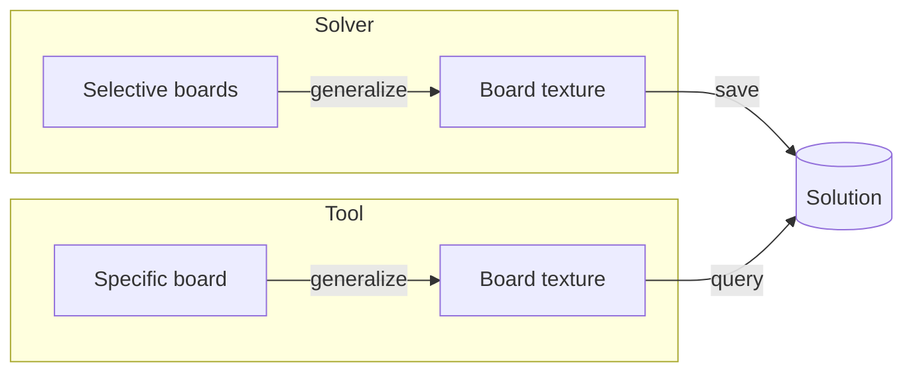
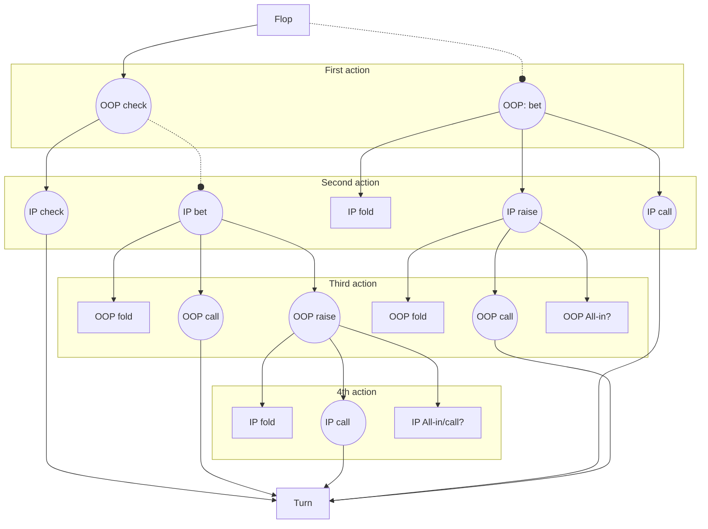

# How solver solve and how tool query
Solver need 4 inputs: **SPR, Ranges, Flop and Game Tree** to solve for a specific flop.

**(TODO: double check in code) Solution data format:** we can extract from the solved result and save data in a format we want. But for now, we don't know exactly what the solver offers.
The solution is a Tree structure (based on game tree). Let call it the **Solution Tree**. For each decision node, solution gives a range of options (fold, call, bet + sizing, raise + sizing) for each hand class (pair, set, draw,...). So we need provide the path to the decision node () and our hand to query.

Tool has inputs: **SPR, Board, actions (a path of game tree) and a specific hand(should be contained in range)** to query.

## Ranges(Positions)
Ranges are get from preflop solution (prelfop-ranges.js) by specifying: **positions of 2 player** and who is the **aggressor**.

For example, a 3bet pot, UTG vs CO, CO 3bet preflop and UTG call. We have **vs_3bet -> call range** of **UTG and 3bet range vs UTG** of CO.
## Flop
Since for now, we can't solve all flops, we must select at least 1 flop for a board texture to solve.



**Problems:** Define all kind of board texture.

## SPR and Game Tree
**SPR** (stack-pot ratio) and **Game Tree** should fit. Should focus on solving SPR of **100BB stack: single raise (spr), 3bet pot and 4bet pot**.

The current config **Game Tree** for all SPR:

**Arrow line:** represent 1 option.

**Round dot line:**  represent multiple options (per bet size), depend on config.

**All-in node:** may be a subtree if stack is deeper/solver more detailed.




# Lookup API
```
preflop_look_up(hero_pos, val_pos, stack, spot) -> [actions]
```
[action] = [fold: %, call: %, raise: %]

spot: rfi, vs_raise, vs_3bet, vs_4bet

if spot is vs_4bet or stack is too short, raise -> all-in


```
preflop_look_up(hero_pos, val_pos, spr, board, spot, hand) -> [actions]
```
[action] = [fold: %, call: %, raise: %]

board -> flop, turn, river

spot = [action of previous rounds, action of this round]

spot must be compliant to game tree and represent the path from root

