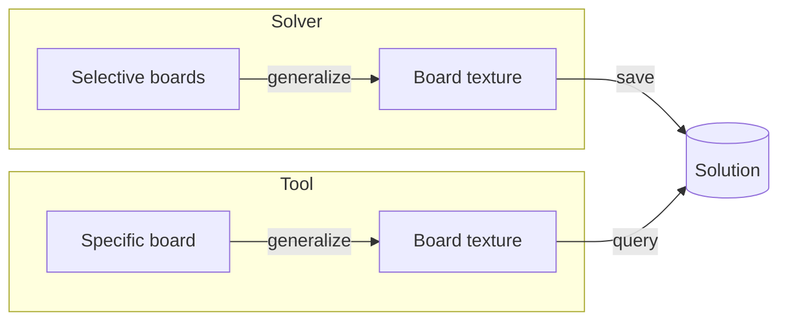
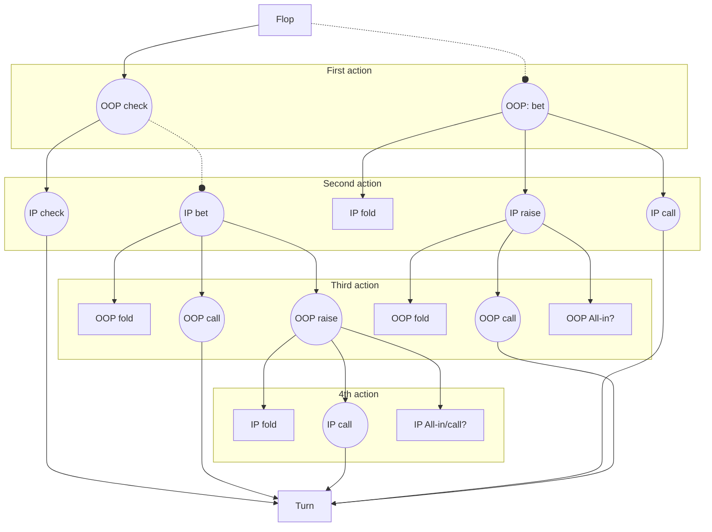
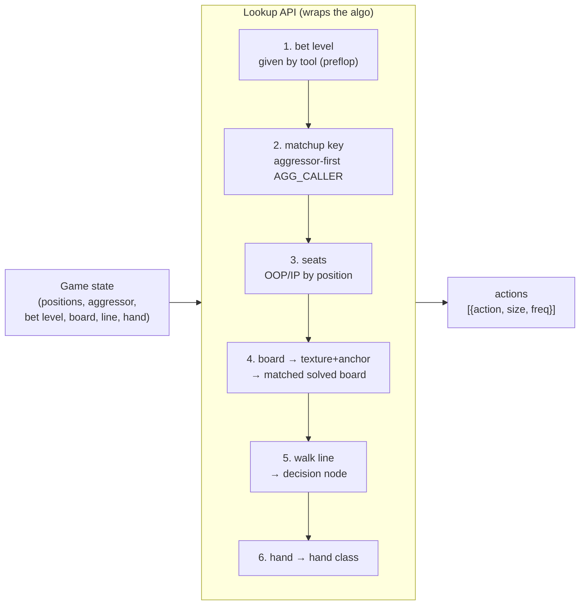

# How solver solve and how tool query
Solver need 4 inputs: **SPR, Ranges, Flop and Game Tree** to solve for a specific flop.

**(TODO: double check in code) Solution data format:** we can extract from the solved result and save data in a format we want. But for now, we don't know exactly what the solver offers.
The solution is a Tree structure (based on game tree). Let call it the **Solution Tree**. For each decision node, solution gives a range of options (fold, call, bet + sizing, raise + sizing) for each hand class (pair, set, draw,...). So we need provide the path to the decision node () and our hand to query.

Tool has inputs: **SPR, Board, actions (a path of game tree) and a specific hand(should be contained in range)** to query.

## Ranges(Positions)
Ranges are get from preflop solution (prelfop-ranges.js) by specifying: **positions of 2 player** and who is the **aggressor**.

For example, a 3bet pot, UTG vs CO, CO 3bet preflop and UTG call. We have **vs_3bet -> call range** of **UTG and 3bet range vs UTG** of CO.
## Flop
Since for now, we can't solve all flops, we must select at least 1 flop for a board texture to solve.



**Problems:** Define all kind of board texture.

## SPR and Game Tree
**SPR** (stack-pot ratio) and **Game Tree** should fit. Should focus on solving SPR of **100BB stack: single raise (spr), 3bet pot and 4bet pot**.

The current config **Game Tree** for all SPR:

**Arrow line:** represent 1 option.

**Round dot line:**  represent multiple options (per bet size), depend on config.

**All-in node:** may be a subtree if stack is deeper and solver has a more detailed config.




# Lookup API

The API is the single entry point for a poker tool. **The tool passes raw game
state only** — positions, stacks, board, action history, hero hand. The API
**wraps all the algorithm logic**: bet-level detection, matchup keying, board
generalization, game-tree navigation and hand-strength classification. The tool
never computes a matchup key, a board texture, or a tree path itself.



## Preflop

```
preflop_lookup(hero_pos, villain_pos, spot, stack, hand=None) -> actions
```

- `spot ∈ {rfi, vs_raise, vs_3bet, vs_4bet}` — the preflop node.
- `hand` optional: with a hand → that hand's mix; without → the whole range map.
- `actions = [fold%, call%, raise%]`.

The API wraps: select the table by `spot`, build the lookup key from the two
positions (`hero`/`villain` decide opener vs responder), read `pure_*` + `mixed`,
and convert `raise → all-in` when `spot = vs_4bet` or the stack is too short.
Source: `preflop-lookup/preflop-ranges.js`.

## Postflop

```
postflop_lookup(hero_pos, villain_pos, aggressor_pos,
                bet_level, board, line, hand) -> actions
```

**Game state the tool passes (nothing pre-computed):**

| Arg | Meaning |
|---|---|
| `hero_pos`, `villain_pos` | the two seats in the pot |
| `aggressor_pos` | who made the last preflop raise (opener / 3bettor / 4bettor) |
| `bet_level` | `srp` / `3bet` / `4bet` — the pot type, from the actual preflop action |
| `board` | 3–5 cards, e.g. `['Ah','7d','2c']` (+ turn, river) |
| `line` | postflop action path so far, e.g. `['X','B33','C']` |
| `hand` | hero hole cards, e.g. `['Ah','Kh']` |

> **Note — bet level is an input, not inferred.** From SPR we *could* guess the
> pot type, but an opponent's weird bet size distorts SPR. Inferring would still
> snap to a plausible **depth**, yet load the **wrong preflop ranges** (srp vs
> 3bet vs 4bet) — and the range matters far more than the depth. The poker tool
> knows exactly what happened preflop, so it passes `bet_level` directly.

**What the API does internally (the wrapped algo):**

1. **Bet level** — taken directly from `bet_level`. It selects both the range
   set and the SPR / game-tree config (all 100bb-effective). **Not** inferred
   from the SPR (see note above).
2. **Matchup key** — aggressor-first `AGG_CALLER` from the positions +
   `aggressor_pos` (e.g. SB opened, BB 3bet ⇒ `BB_SB`).
3. **Seats** — OOP/IP by postflop position order (blinds act first), independent
   of who is the aggressor.
4. **Board generalization** — classify the board's texture, take its anchor rank
   (top card, or pair rank on paired boards), and snap to the closest solved
   board of that texture (see [BOARD.md](BOARD.md)).
5. **Navigate** — walk `line` from the root of the postflop data tree to the
   decision node, resolving the street (flop / turn / river) and the canonical
   action-line slot.
6. **Hand class** — classify `hand` on the board into one of the 18
   hand-strength classes.
7. **Return** the node's strategy for that hand class.

**Return shape** — the mixed strategy over the node's *legal* actions, plus the
resolution metadata:

```
{
  actions: [ {action: 'Check', size: 0,  freq: 0.62},
             {action: 'Bet',   size: 33, freq: 0.30},
             {action: 'Bet',   size: 75, freq: 0.08} ],
  hand_class:    'top_pair_strong',
  matchup:       'BB_SB',
  bet_level:     '3bet',
  matched_board: 'A72r',
  oop:           'SB',
  ip:            'BB',
  exploitability: 0.4
}
```

**Constraints / fallbacks:**
- `line` must be a canonical line the data tree stores (the sampled decision
  nodes / action lines). Unmatched lines fall back to the nearest stored node.
- If a matchup/bet-level/board has no solved data, the API returns `null` (the
  tool then falls back to a heuristic or the preflop-style default).
- `actions` sizes are bet/raise percentages of the pot, mirroring the solved
  game-tree sizings; the set of legal actions is dynamic per node.

