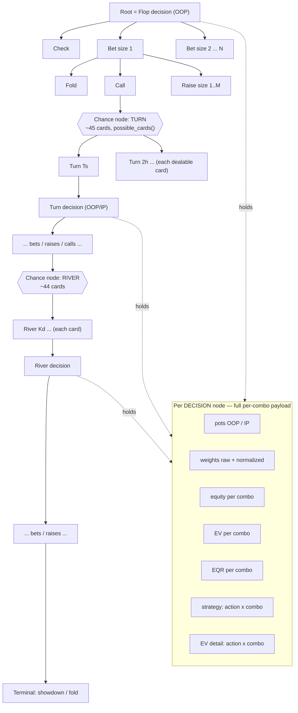
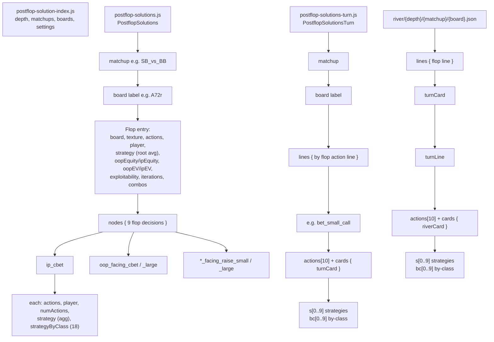
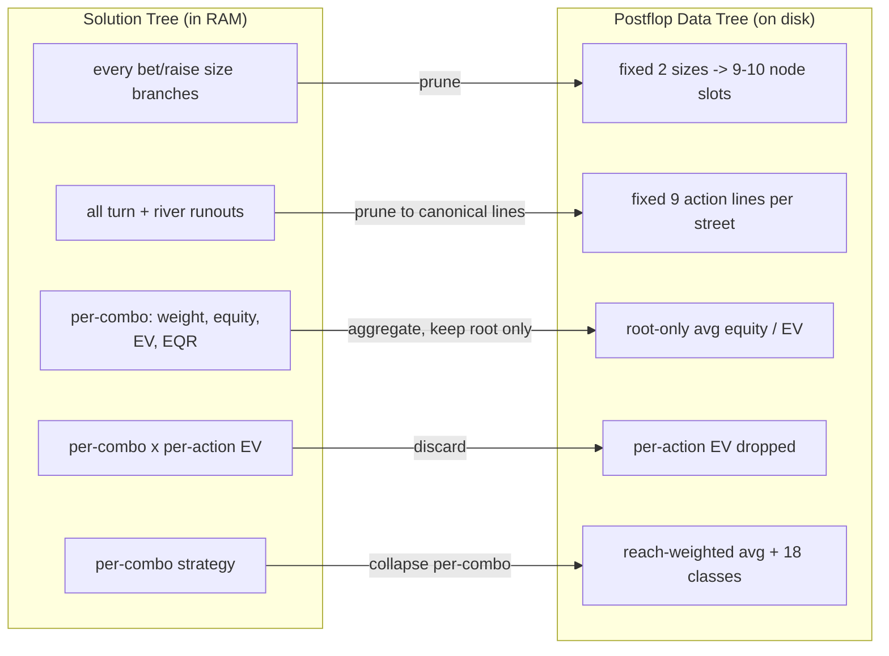

# Trees: Solution Tree vs. Postflop Data Tree

Two very different structures live in this project:

- **Solution Tree** — the *full* game tree the CFR solver (`postflop-solver`) can
  expose in memory. Rich, per-combo, per-action, every runout. Never persisted whole.
- **Postflop Data Tree** — the *pruned, aggregated* structure the pipeline
  (`scripts/precompute-postflop.mjs` + `solver-native`) extracts and saves to
  `js/data/`. Small enough to ship to the browser.

The pipeline walks the Solution Tree, samples a fixed set of nodes, collapses
per-combo detail into reach-weighted averages + 18 hand-strength buckets, and
writes the Postflop Data Tree.

---

## 1. Solution Tree (solver capacity)

A standard poker game tree held by `PostFlopGame`. Alternating **decision nodes**
(OOP/IP) and **chance nodes** (turn/river cards), terminating at showdown/fold
**terminal nodes**. It branches on *every* configured bet/raise size, at every
street, across *all* legal runouts.

Every **decision node** can emit — for **each live private-hand combo** (up to 1326,
minus board blockers) — the packed `get_results()` payload
([solver/src/lib.rs](solver/src/lib.rs#L281), [solver-native/src/main.rs](solver-native/src/main.rs#L232)):

| Field | Granularity | Source method |
|---|---|---|
| raw reach weight | per combo | `weights(p)` |
| normalized weight (combo count) | per combo | `normalized_weights(p)` |
| equity | per combo | `equity(p)` |
| EV (chips) | per combo | `expected_values(p)` |
| EQR (equity realization) | per combo | derived `ev / (pot·eq)` |
| strategy (mixed freq) | per combo × action | `strategy()` |
| per-action counterfactual EV | per combo × action | `expected_values_detail(p)` |
| pot sizes (OOP/IP view) | node | `total_bet_amount()` + `starting_pot` |
| available actions + amounts | node | `available_actions()` |

**Chance nodes** additionally expose `possible_cards()` (52-bit mask of dealable
cards). Node locking (`lock_current_strategy`) and `exploitability()` are also
available.

**Key traits:** full branching on every size, all runouts, per-combo + per-action
resolution. This is what the solver *can* produce — it is huge and lives only in
RAM during a solve.

---

## 2. Postflop Data Tree (extracted + persisted)

What the pipeline keeps. It samples a **fixed vocabulary** of canonical decision
nodes and action lines, collapses per-combo detail into:

- **aggregate strategy** — reach-weighted average freq per action, and
- **strategyByClass / `bc`** — the same, bucketed into 18 hand-strength classes
  (`classify_hand_strength`, [solver-native/src/main.rs](solver-native/src/main.rs#L628)).

Per-combo equity/EV/EQR and per-action EV are **dropped** (only *root* average
equity/EV survive). Files live under `js/data/`:

| File | Variable | Holds |
|---|---|---|
| `postflop-solution-index{suffix}.js` | `PostflopSolutionIndex` | metadata: depth, matchups, boards, settings |
| `postflop-solutions{suffix}.js` | `PostflopSolutions` | flop entries + 9 flop decision nodes |
| `postflop-solutions-turn{suffix}.js` | `PostflopSolutionsTurn` | turn nodes per flop line per turn card |
| `js/data/river/{depth}/{matchup}/{board}.json` | (per-file JSON) | river nodes per flop+turn line per river card |

The **10 canonical node slots** per street (indices `s[0..9]` / `bc[0..9]`,
`StreetNodes`, [solver-native/src/main.rs](solver-native/src/main.rs#L820)):
`OOP first`, `IP after check`, `IP vs small bet`, `OOP vs small probe`,
`OOP vs raise (bet small)`, `OOP vs raise (bet large)`, `IP vs x-raise (small)`,
`IP vs x-raise (large)`, `IP vs large bet`, `OOP vs large probe`.

The **9 action lines** that advance a street (`action_lines`,
[solver-native/src/main.rs](solver-native/src/main.rs#L1044)): `check_check`,
`bet_small_call`, `bet_large_call`, `xbet_small_call`, `xbet_large_call`,
`bet_small_raise_call`, `bet_large_raise_call`, `xbet_small_raise_call`,
`xbet_large_raise_call`.

---

## 3. Solution Tree → Data Tree (what is lost)

**Summary:** the Solution Tree is a full per-combo, per-action game tree over all
sizes and runouts (RAM-only). The Postflop Data Tree is a size-normalized,
line-normalized, reach-weighted + hand-class–bucketed digest that ships to the
browser under `js/data/`.
