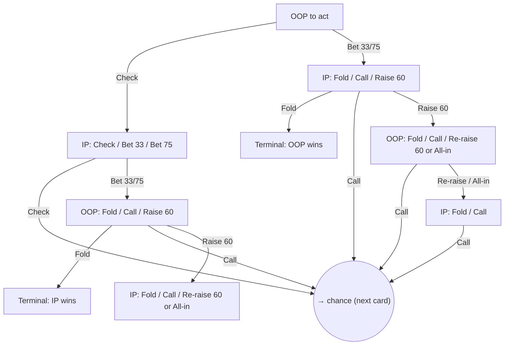
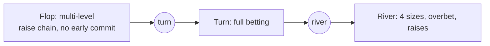
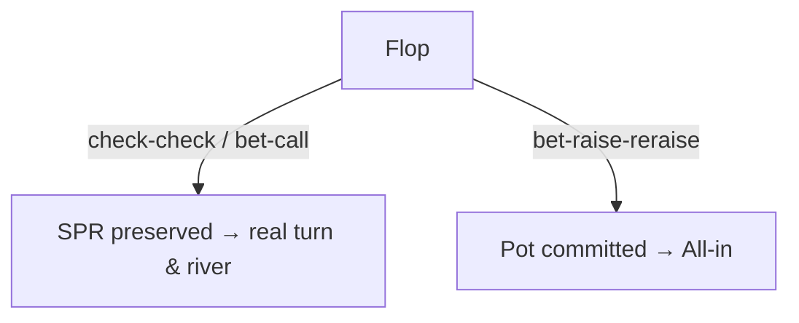
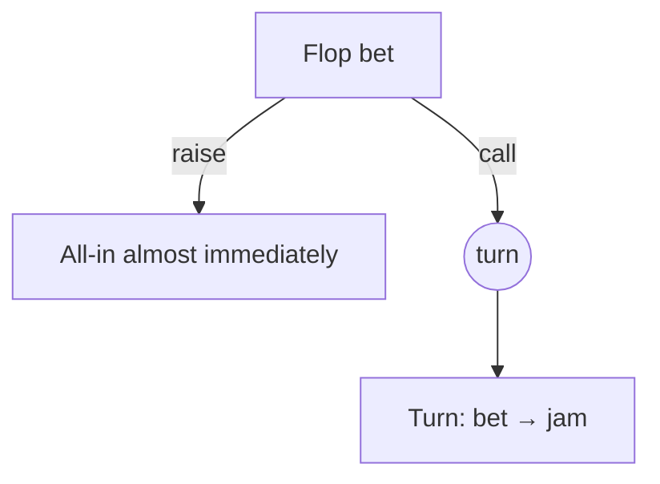

# Postflop Game Tree

This documents the betting **game tree** the WASM solver builds and solves for
each 100bb case. All three cases share the **same bet/raise sizings** — only the
effective stack (SPR) differs, and that is what decides how many raise levels fit
before the players are pot-committed and the line collapses to an all-in.

See [POST_FLOP_SOLVER_GUIDE.md](POST_FLOP_SOLVER_GUIDE.md) for the full pipeline;
this file focuses on the tree shape.

---

## Cases (all 100bb effective)

| Case | Preflop line | Pot | Stack | SPR | Commitment behavior |
|------|--------------|-----|-------|-----|---------------------|
| `srp`  | single-raised pot | 100 | 1600 | ~16  | Deep — several raise levels before anyone is committed |
| `3bet` | 3bet pot          | 100 | 540  | ~5.4 | Medium — a flop raise war commits quickly; check-check / bet-call keeps SPR for later streets |
| `4bet` | 4bet pot          | 100 | 170  | ~1.7 | Shallow — almost any flop raise commits → all-in |

Pot is normalized to `100`; SPR = `stack / pot`.

---

## Bet / raise sizings (shared by all three cases)

Defined by `LINE_BET_SIZES` in [scripts/precompute-postflop.mjs](scripts/precompute-postflop.mjs).

| Street | Bet sizes | Raise | Donk (OOP lead) |
|--------|-----------|-------|-----------------|
| Flop   | 33% / 75% | 60% | — |
| Turn   | 33% / 75% | 60% | 50% |
| River  | 25% / 33% / 75% / 120% | 60% | 50% |

- **Donk betting is enabled** (`donkOption: true`) at 50% on turn and river.
- **Raise is 60%** of the pot on every street.
- The **120% river bet** is an overbet; at low SPR it is capped at the stack and
  becomes an all-in.

---

## One street, expanded

At the start of a street OOP acts first. Each bet can be raised, each raise
re-raised, and so on until the remaining stack is small enough that the solver
offers only an all-in. `X` = Check, `C` = Call, `→ chance` = next card is dealt.

The **depth of the raise chain** (Raise → Re-raise → Re-re-raise → … → All-in)
before it collapses to all-in is controlled by the geometry (SPR) plus the
all-in thresholds passed to `manager.init()`:

- **`add_allin_threshold` (1.5)** — once the remaining stack is within ~1.5 pots,
  the solver adds an explicit all-in action.
- **`force_allin_threshold` (0.15)** — if a bet/raise would leave only a trivial
  stack behind (~<15%), it is promoted straight to all-in (no tiny bet stub).
- **`merging_threshold` (0.1)** — near-identical bet sizes (within 10%) are merged
  to keep the tree small.

So the *same* sizings produce **deeper** trees at high SPR and **shorter** trees
(that terminate in all-in sooner) at low SPR — automatically, per case.

---

## How each case fills the tree

### `srp` — SPR ~16 (deep)

Plenty of stack behind. A flop bet, raise, and re-raise all still leave both
players room to keep raising, so the raise chain runs several levels before the
solver introduces an all-in. Every betting line (check-check, bet-call,
check-bet-call, raise wars) continues through the turn and river with real
multi-street play.

### `3bet` — SPR ~5.4 (medium)

- **check-check** or **bet-call**: pot stays modest, SPR is preserved, so turn and
  river still have meaningful multi-size betting.
- **flop raise war**: bet → raise → re-raise commits the stacks fast, so a flop
  raise typically leads to all-in.

### `4bet` — SPR ~1.7 (shallow)

Very little stack relative to pot. After a single flop bet, the remaining stack is
close to pot-sized, so nearly any raise is (or immediately becomes) an all-in.
Play is usually one street of betting, then jam-or-fold.

---

## Solved tree vs. extracted lookup nodes

The solver builds and solves the **entire** tree above (all raise levels, all
turn/river cards) in one Nash solve. The precompute script, however, currently
**extracts a subset** of nodes into the lookup files:

- Flop: root (OOP first action), `ip_cbet` (`[0]`), `ip_facing_cbet` (`[1]`),
  `oop_facing_cbet` (`[0,1]`).
- Turn/river (extracted by default; disable with `--no-turn` / `--no-river`):
  the `check_check`, `bet_call`, and
  `xbet_call` continuation lines per card.

The raise-response nodes (e.g. OOP facing a flop raise) exist in the solved tree
but are not yet stored for lookup — extending extraction to cover them is a
follow-up if the client needs those decision points.
