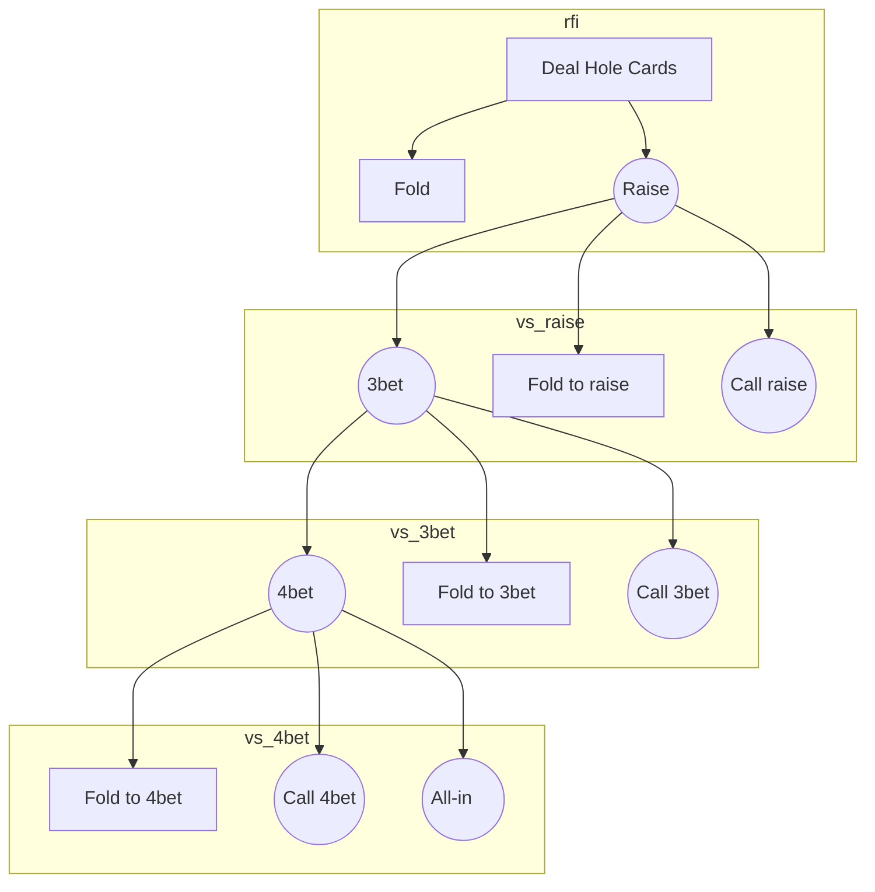

Preflop game tree

```mermaid
graph TB
    Start[Deal Hole Cards]

    subgraph rfi
        Start --> F[Fold]
        Start --> R((Raise))
    end

    subgraph vs_raise
        R --> FR[Fold to raise]
        R --> CR((Call raise))
        R --> 3((3bet &emsp;))
    end

    subgraph vs_3bet
        3 --> F3[Fold to 3bet]
        3 --> C3((Call 3bet))
        3 --> 4((4bet &emsp;))
    end

    subgraph vs_4bet
        4 --> F4[Fold to 4bet]
        4 --> C4((Call 4bet))
        4 --> A((All-in &emsp;))
    end
```