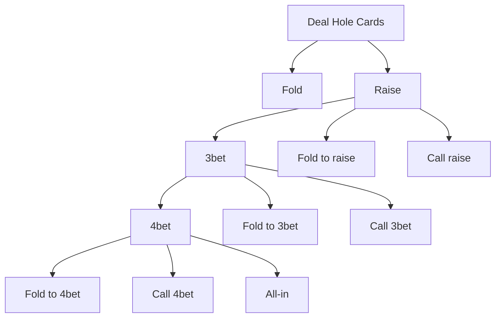

Preflop game tree

```mermaid
graph TB
    Start[Deal Hole Cards]

    Start --> F[Fold]
    Start --> R[Raise]

    R --> FR[Fold to raise]
    R --> CR[Call raise]
    R --> 3[3bet]

    3 --> F3[Fold to 3bet]
    3 --> C3[Call 3bet]
    3 --> 4[4bet]

    4 --> F4[Fold to 4bet]
    4 --> C4[Call 4bet]
    4 --> A[All-in]
```