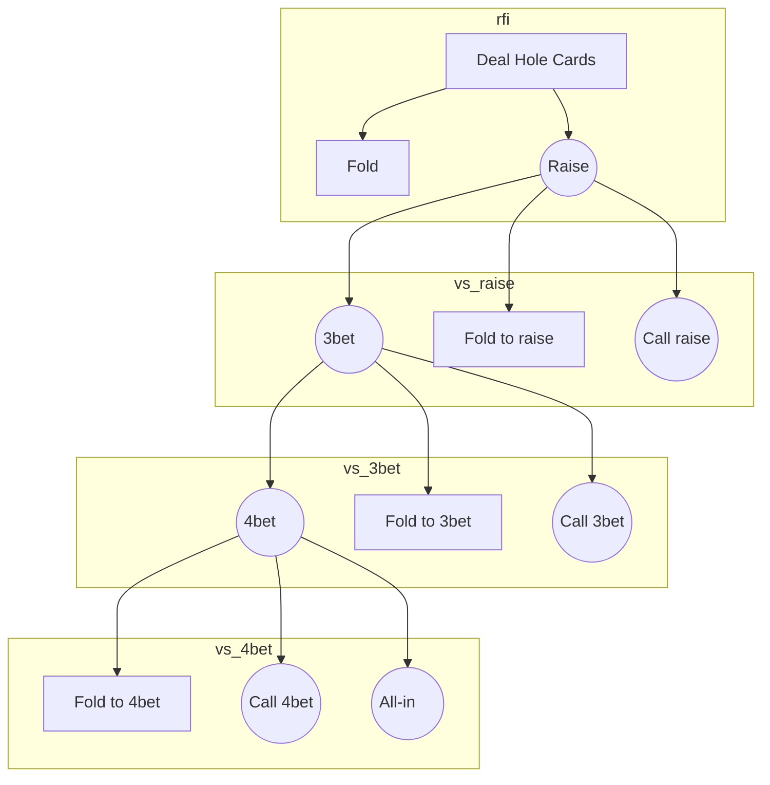
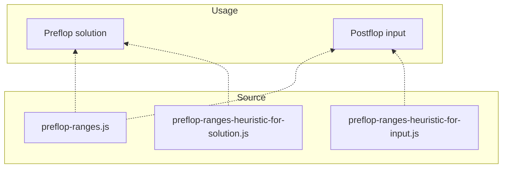

## Preflop game tree

## Preflop matchup

The current solution in preflop-ranges.js assume that pot is always headsup.

For example, spot is vs_3bet, hero position is SB, there are only SB vs BB. Because it assumes SB open, BB 3bet, SB acts. SB never face a 3bet from CO for example, because if consider only SB and CO, SB must open before to be 3bet by CO.

However, in real gameplay, maybe UTG open, CO 3bet, fold to SB. Now SB faces a 3bet from CO and need to act with strong hands like AK, QQ, JJ,... can't always fold.

So we need to make ranges for SB for that spot, not really solved by our GTO engine, but easy to find the acceptable solution online.

We made 2 different ranges for 2 use cases: (1) preflop solution and (2) input ranges for post-flop solver. The differences: for preflop solution, spot like UTG open, CO 3bet, at SB we only want to 4bet or fold, to make an easy game. However, in real gameplay again, there are players cold-call 3bet, so we still need to figure out call-range here to have something to solve post-flop. In short, the cold-call range here (multiway preflop) is only for villain.

